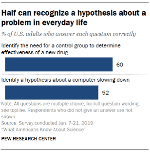

```{r setup, include=FALSE}
# set knit options

knitr::opts_chunk$set(
  fig.width=9, 
  fig.height=5, 
  fig.retina=3,
  fig.align="center",
  out.width = "100%",
  cache = FALSE,
  echo = FALSE,
  message = FALSE, 
  warning = FALSE
)

# libraries
library(gapminder)
library(socviz)

# source
source(here::here("slides/R/funcs.R"))

```

## Welcome to POL 051 Discussion Section!

::: incremental
Why should we care about data?
:::

## Misinformation

```{r,out.width="60%"}

```

## Scientific Literacy

```{r,out.width="40%"}

```

## Meet your TA

:::::: columns
::: {.column width="50%"}
-   Political Science PhD Candidate
    -   Comparative Politics and Methodology
    -   Crime, Violence, Behavior, and Gender
-   Go Beavs! (Oregon State Alum)
-   Enjoy paddle boarding, gravel/mountain biking, downhill/xc skiing, and playing hockey
:::

:::: {.column width="50%"}
::: {layout-ncol="2"}
{style="width:100%; aspect-ratio:1/1; object-fit:cover;"}

{style="width:100%; aspect-ratio:1/1; object-fit:cover;"}

{style="width:100%; aspect-ratio:1/1; object-fit:cover;"}

{style="width:100%; aspect-ratio:1/1; object-fit:cover;"}
:::
::::
::::::

## Tell Me About you!

-   What is your name?
-   What is your major?
-   What year are you?
-   What was your favorite childhood book, movie, or TV show?

## Section learning objectives

-   By the end of this course you will be able to...
    -   Analyze real-world data to answer questions about different relationships.
    -   Feel comfortable manipulating data in R
    -   Craft effective visualizations of patterns in data
    -   Draw causal diagrams and identify obstacles to causal claims
    -   Understand the basics of regression and uncertainty

# Course info {.smaller}

|   | Day | Time | Location |
|----|----|----|----|
| Lectures | Tue & Thur. | 3:10 pm - 4:30 pm | Wellman 2 |
| Discussion/Lab | Fri. | A04: 9:00 AM - 9:50 AM<br>A05: 10:00 AM - 10:50 AM<br>A06: 11:00 AM - 11:50 AM | Kerr Hall 451 |
| Office Hours | Tue | 12:00 - 3:00 PM | Kerr Hall 569 |

## Course toolkit

-   All materials for this course are **free and online.** You will do all of your analysis with the open source (and free) programming language R and RStudio.

    -   Let's walk through the course website: <http://haleydaarstad.com/pol051-su26/>

## Support

-   Attend office hours
-   Reserve email for questions that can be answered quickly and timely

## Accessibility

-   If you believe you have a disability requiring an accommodation or would like additional information about the resources available for students with disabilities, please visit the UC Davis Student Disability Center website at [sdc.ucdavis.edu](sdc.ucdavis.edu).

-   Students must contact me about any accommodations, as the TA, I have limited access.

-   Outside Resources - The Student Academic Success Center is a campus-wide resource assisting students by helping them improve in study skills, academic writing, and other specific topics.

# Section policies

## Sharing / reusing code policy

-   I am aware that there is a large amount of code available online, and many tasks may have solutions posted

-   Unless explicitly stated otherwise, this course's policy is that you may make use of any online resources (e.g. RStudio Community, StackOverflow, etc.) but you must explicitly state where you obtained any code you directly use or use as inspiration in your solution(s).

-   AI cannot be used to generate code/answers.

## Policy on AI

**AI is NOT allowed for usage in this classroom to generate any code or answers.**

-   You may not use artificial intelligence tools such as ChatGPT, Gemini, Claude, Grok, etc. to complete academic work

    -   The Office of Student Support and Judicial Affairs (OSSJA) considers the unauthorized use of content generated by artificial intelligence (AI) to be academic misconduct and/or plagiarism (see: <https://ossja.ucdavis.edu/code-academic-conduct>).

## Academic Integrity

-   Cheating and plagiarism will be evaluated and disciplined according to University policy.

-   For information on academic integrity, please read: <http://cai.ucdavis.edu/aip.html>.

-   You are responsible for understanding and following all aspects of University policy on academic integrity; ignorance is not an excuse.

## Most importantly!

Ask if you're not sure if something violates a policy

## This week's tasks

-   Download R and RStudio
-   R Basics

# Downloading R

## Why R? {.smaller}

::: incremental
-   R is a coding language and environment built for statistical computing and graphics that includes a large variety of statistical and graphical techniques.

-   As political scientists R is an effective way to store and handle data, and a large selection of data analysis tools including graphing tools in a coherent and effective language.

-   The majority of users will use RStudio, an IDE or integrated development environment, to write the code and see outputs.

    -   **RStudio** is a software application with a code editor, compiler, debugger, and project manager in a single interface that allows us to write, edit, compile, and debug code in a singular location.
:::

## R

-   R is freely maintained by an international team of developers and is available through *The Comprehensive R Archive Network*.

-   Follow the instructions to download R.

-   If you are using an older computer or iPad, go to **Using Posit Cloud for R in the FAQ page**.

## Instructions for Downloading R

-   Go to The Comprehensive R Archive Network webpage:

    -   <https://cran.r-project.org>

-   To install R on Windows, click the "Download R for Windows" link.

-   To install R on a Mac, click the "Download R for Mac" link.

# Downloading RStudio

## What is RStudio?

-   One way to picture what RStudio does is to compare it to Microsoft Word, a software application that allows us to write documents.

-   RStudio, instead of being a platform to write text, helps us write in the coding language R. Follow the instructions below to download RStudio.

    -   In more complex terms, RStudio is an IDE for R

## Instructions for Downloading RStudio {.smaller}

-   Go to the [Posit RStudio Desktop page](https://posit.co/download/rstudio-desktop/).

-   To install for Mac:

-   Scroll to the button that says "Install R on a Mac," and click the “Download R for Mac OS 13+” link.

    -   If you're using an older version, click the "Previous Versions" link to find a version that works with your computer.

-   To install for Windows:

    -   Scroll to the button that says "Install R on Windows 10/11," and click the link to download.

# R Basics

## R as a language

::: incremental
-   Think of R as a language; it has: vocabulary, punctuation, grammar, and syntax

-   R is a language you can use to speak to your computer to tell it how to manage and visualize data
:::

## R Layout

There are four primary quadrants in RStudio:

-   **Source pane**
-   **Console pane**
-   **Environment pane**
-   **Output pane**

## R Layout


# Creating an R Project

## What is a R Project?

An *R project* is a self-contained directory, that automatically will set the working directory to the project's root folder.

The *working directory* is the folder on your computer that you have set to save files to during your working session in R.

Essentially, you are telling your computer to save any new documents or updates to this specific folder, rather than maybe your downloads folder.

## Step 1: Make a Folder {.smaller}

-   Mac

    -   Open **Finder** and click **Desktop** on the left side

        -   On the top of your screen go to **File** and click **New Folder**

            -   Name this folder POL 051 - F26

-   Windows

    -   Open **File Explorer** and go to **Desktop**

        -   Click/tap on **New** on the command bar, and click/tap on **Folder** in the drop-down menu.

            -   Name this folder POL 051 - F26

## Step 2: Create the R Project. {.smaller}

To create a new working directory in RStudio:

1.  Use **File → New Project** or use the **New Project** button (available on the Projects toolbar in the top right corner or on the global toolbar at the top left corner).
2.  This will open the “New Project Wizard” popup.
3.  Click "Existing Directory".
4.  Click "Browse" and search for your folder "POL 051 - F26"
5.  This sets the working directory automatically to the folder you just created.

## Step 3: Set the Working Directory.

If you have a sub folder in the project you will need to manually set the working directory.

```{r}
#| echo: True
#| eval: false

# Set working directory (replace this with your own)

# Mac Users
setwd("/Users/yourname/Desktop/filename/filename")

# Windows Users
setwd("C:/Users/YourName/Documents/MyFolder")

# To check if the working directory is set correctly, use the following code:

# Returns the filepath of the current working directory
getwd()
```

# R Coding Basics

## Writing "Text"

-   Writing text in R is called a script, a string of letters connected by the use of " " or ' '.

```{r}
#| echo: True
#| eval: true

"Hello World!"
'Hello World!' 

```

## Writing Numbers

-   To output numbers you just type out the number. Also, note that I do not use a comma when writing out my four-digit number:

```{r}
#| echo: True
#| eval: true

5
75
1000

```

## Basic Calculations {.smaller}

R at its core is a gigantic calculator, so let's practice doing basic calculations.

```{r}
#| echo: true
#| eval: false

# addition
10 + 2

# subtraction
10 - 2

# multiplication
10 * 2

# division
10/2

# exponent
10^2

```

## Basic Calculations {.smaller}

R at its core is a gigantic calculator, so let's practice doing basic calculations.

```{r}
#| echo: true

# addition
10 + 2

# subtraction
10 - 2

# multiplication
10 * 2

# division
10/2

# exponent
10^2
```

## Comments

It's also important to annotate your code. It will help you write notes and explain what you are doing. To annotate your code, you will use the number sign #:

```{r}
#| echo: true

# addition
10 + 2
# the answer is 12
```

## Creating Objects {.smaller}

In R, we save our data in what we call objects! Objects store information about different types of elements. If you know any other coding languages, they typically call these variables.

-   `print()` is a function that 'prints' out an output from an object.

-   **R functions** are like the verbs of the R coding language; they tell your computer what action to make with sets of information.

    -   A function is usually defined by a keyword and then parentheses.

```{r}
#| echo: true

# The <- saves the calculation as math
math <- 10 + 2
#print()
print(math)

```

```{r}
#| echo: true

# The = saves the calculation as math
math = 10 + 2
# print() will print out what is saved in the object math
print(math)
```

## Data Types {.smaller}

There are 6 types of data in R that are important to know, but the essential ones are logical, numeric, and character.

In this class we are going to focus on only three: Logical, Numeric, and Characters.

1.  **Logical**: also known as Boolean data, logical data is shown as TRUE or FALSE values:

```{r}
#| echo: true

logical1 <- TRUE
logical2 <- FALSE

# The class() function outputs the data type of the object
class(logical1)


print(logical2)
print(class(logical2))

```

## Data Types

2.  **Numeric** represents all data types that are real numbers with or without decimal points.

```{r}
#| echo: true


height <- 5.5
acres <- 1000

class(height)


print(acres)
print(class(acres))
```

## Data Types

3.  **Character** specifies character or string values in a variable such as a singular character 'A' or a string of characters in 'Apple'.

```{r}
#| echo: true

# Use '' or "" to show it's a string of characters
motorsports <- "formula1"

print(motorsports)
print(class(motorsports))
```

# Packages

## What is a Package?

-   **Packages** are collections of R functions, data, and code compiled in a well-defined format

-   Some packages come pre-installed in R.

-   However, the majority do not, so you need to install them first using the R function `install.packages`

```{r}
#| echo: true
#| eval: false

install.packages("tidyverse") # install this package
```

## Using a Package

-   After installing the packages, we need to "attach" the package.

    -   This means telling your computer that you want to use that package during this working session

-   You can do this by using the function `library()` and the name of the package.

```{r}
#| echo: true
#| eval: false

library("tidyverse")
```

## Using juanr

-   We need to install the package juanr

    -   This package includes a curated set of data created by Professor Juan Tellez.

```{r}
#| echo: true
#| eval: false

install.packages("remotes")
remotes::install_github("hail2thief/juanr")

```
